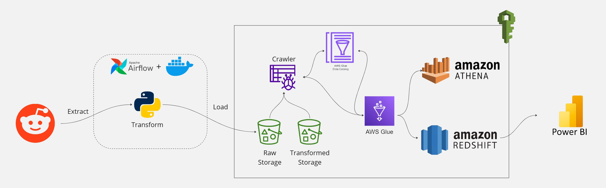

# Reddit Data Pipeline

A data engineering project that sets up an end-to-end data pipeline for extracting, transforming, and loading (ETL) data from Reddit. This pipeline leverages various tools and techniques to collect data, process it, and store it for analysis.


# Data Pipeline with Reddit, Airflow, Celery, Postgres, S3, AWS Glue, Athena, and Redshift

This project provides a comprehensive data pipeline solution to extract, transform, and load (ETL) Reddit data into a Redshift data warehouse. The pipeline leverages a combination of tools and services including Apache Airflow, Celery, PostgreSQL, Amazon S3, AWS Glue, Amazon Athena, and Amazon Redshift.

## Table of Contents

- [Overview](#overview)
- [Architecture](#architecture)
- [Prerequisites](#prerequisites)
- [System Setup](#system-setup)
- [Video](#video)

## Overview

The pipeline is designed to:
Data Extraction: Retrieves data from the Reddit API, supporting subreddit and post-specific filters.
Data Transformation: Cleans, structures, and formats the extracted data for consistency and usability.
Data Loading: Stores processed data in a chosen data warehouse for easy querying and analysis.
Scheduling: Configurable scheduling to automate pipeline runs.
Architecture
The project follows a modular ETL pipeline structure:

Extraction: Pulls data from Reddit’s API using pre-configured parameters.
Transformation: Processes raw data to ensure it meets analytical needs.
Loading: Stores data in a database or data warehouse.
Orchestration: Manages pipeline execution and dependencies.

## Architecture

1. **Reddit API**: Source of the data.
2. **Apache Airflow & Celery**: Orchestrates the ETL process and manages task distribution.
3. **PostgreSQL**: Temporary storage and metadata management.
4. **Amazon S3**: Raw data storage.
5. **AWS Glue**: Data cataloging and ETL jobs.
6. **Amazon Athena**: SQL-based data transformation.
7. **Amazon Redshift**: Data warehousing and analytics.

## Prerequisites
- AWS Account with appropriate permissions for S3, Glue, Athena, and Redshift.
- Reddit API credentials.
- Docker Installation
- Python 3.9 or higher

## System Setup
1. Clone the repository.
   ```bash
    git clone https://github.com/AbdelrahmanSharouda/reddit_datapipeline.git
   ```
2. Create a virtual environment.
   ```bash
    python3 -m venv venv
   ```
3. Activate the virtual environment.
   ```bash
    source venv/bin/activate
   ```
4. Install the dependencies.
   ```bash
    pip install -r requirements.txt
   ```
5. Rename the configuration file and the credentials to the file.
   ```bash
    mv config/config.conf.example config/config.conf
   ```
6. Starting the containers
   ```bash
    docker-compose up -d
   ```
7. Launch the Airflow web UI.
   ```bash
    open http://localhost:8080
   ```


## Video
 This is a guided project from a youtube channel called CodeWithYu 


 [](https://www.youtube.com/watch?v=LSlt6iVI_9Y)